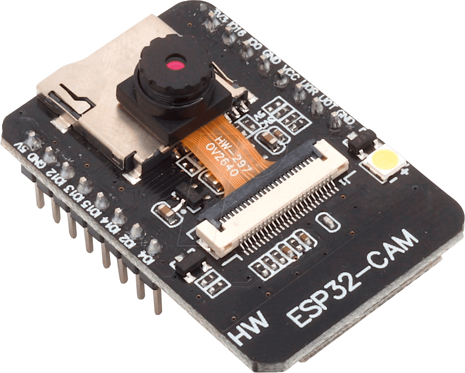
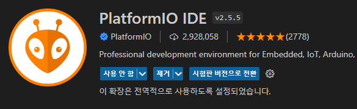
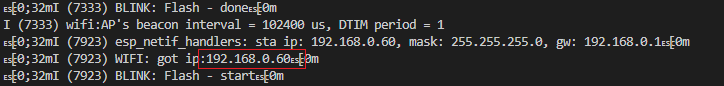

# 2. Activate digitizer
* 2번 프로젝트는 학습된 CNN 모델을 이용한 숫자인식 과정입니다.
* 해당 [사이트](https://github.com/jomjol/AI-on-the-edge-device)에서 제공하는 오픈소스를 사용하여 진행하였습니다.
* esp32-cam의 메모리상에 개발된 펌웨어를 업로드해야합니다. 



- 아래의 두가지 방법으로 개발 가능
  1. VSCode 상에서 PlatformIO 을 통한 업로드 (권장)
  2. 오픈소스 개발자가 제공하는 [사이트](https://jomjol.github.io/AI-on-the-edge-device/index.html)에서 원격으로 업로드

## Getting Started
- /sd-card 경로 내 파일을 sd 카드에 저장
- [wlan.ini](sd-card/wlan.ini) 파일에 와이파이 SSID, PASSWORD 추가
- esp32-cam 과 PC 연결 
(이미지는 ESP32 와 FDTI Serial 케이블 연결 예시)


## Upload firmware
#### 1. VSCode 설치 & PlatformIO 확장도구 설치
- https://code.visualstudio.com/
- VSCode 실행 -> 확장 탭 열기(Ctrl + Shift + X) -> PlatformIO 검색 후 설치



#### 2. PIO Terminal 실행 후 아래의 명령어 입력
- 시리얼 모니터는 다른 프로그램이 참조중이면 실행되지 않음 (e.g. Arduino IDE) 
```
$ pio run --target erase    # 기존 데이터 제거
$ pio run --target upload   # 업로드
$ pio device monitor        # 시리얼 모니터 ON
```

#### 또는 해당 [사이트](https://jomjol.github.io/AI-on-the-edge-device/index.html)에서 안내에 따라 진행가능합니다. 

## Initial Settings

- 시리얼 모니터에 출력되는 로컬 주소에 접속 후 안내에 따라 진행
- More, https://github.com/jomjol/AI-on-the-edge-device/wiki/Configuration